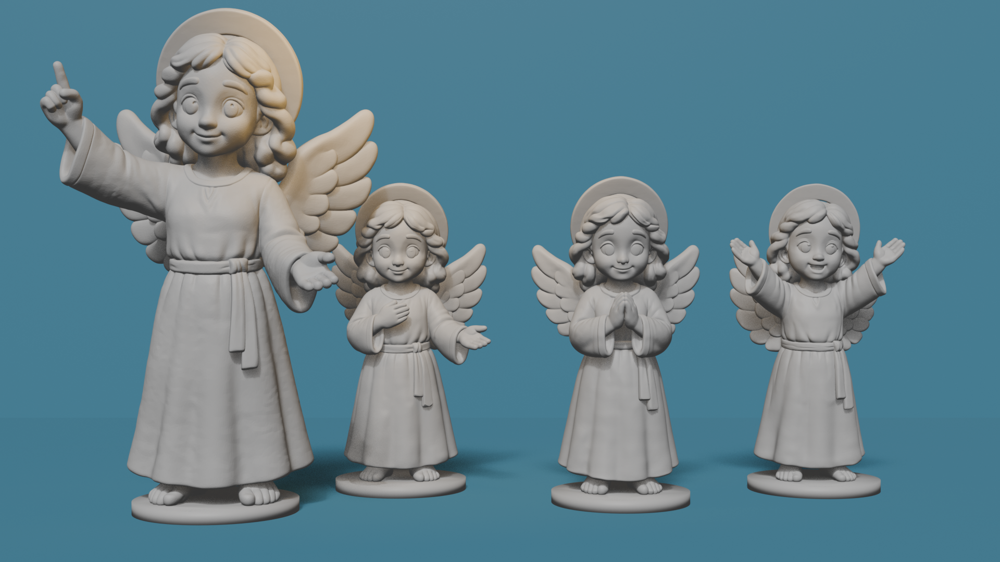

# La nativité

Contient les figurines 3D suivantes :

## Le voyage vers Bethléem "Voyage"
- Marie enceinte
- Joseph
- Un âne

## Dossier "Anges"
- Ange de la nativité
- Petit ange 1
- Petit ange 2
- Petit ange 3

# A venir 

## Dossier "Bergers"
- Adulte 1
- Adulte 2
- Enfant 1
- Enfant 2
- Mouton couché
- Mouton debout

## La Naissance
- Marie à genoux
- Mangeoire 
- Enfant jésus
- Etoile
(il faut aussi imprimer Joseph et l'âne de "Voyage")

> [!IMPORTANT]
Le projet en est à ses débuts. Les fichiers n'ont pas encore été tous testés.

Les retours d'utilisateurs sont attendus !
